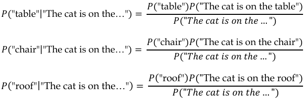

# Definitions
**AANs = artificial neural networks**: computational models inspired by the structure and functioning of the human brain.
**AI orchestrator**: is lightweight libraries that make it easier to embed and orchestrate LLMs within applications.
**ARC = AI2 Reasoning Challenge**: benchmark is used to measure LLMs’ reasoning capabilities and to stimulate the development of models that can perform complex NLU tasks.
**Attention mechanisms**: is a mechanism that enables the model to focus on relevant parts of the input sequence while generating the output.
**Assistant models**: LLMs models that are further fine-tuned with input-output pairs that include instructions and the model’s attempts to follow those instructions.
**Autoregressive model**: e in the context of transformers refers to the fact that the model predicts the next token in the sequence, conditioned on all the previous tokens.
**Copilot software**: is a new category of software that serves as an expert helper to users trying to accomplish complex tasks.
**CoT = Chain of Thought**: is a technique that enables complex reasoning capabilities through intermediate reasoning steps.
**Backpropagation**: is the process of training an ANN.
**Bayes’ theorem**: P(A|B)=(P(B|A)\*P(A))/P(B)
**Base models**: LLMs models that are trained on vast amounts of text data, often sourced from the internet. However, they might not always be precise or focused on specific instructions.
**BERT = Bidirectional Encoder Representations from Transformers**: models use only the encoder part which is designed for NLU tasks such as text classification, question answering, and sentiment analysis.
**CAI = constitutional AI**: aims to make the model safer and more aligned with human values and intentions by preventing toxic or discriminatory output
**Deep learning**: is a branch of machine learning that is characterized by neural networks with multiple layers.
**Embedding**s: are a way to represent words, subwords, or characters in a continuous vector space.
**Encoder**: takes the input sequence and produces a sequence of hidden states, each of which is a weighted sum of all the input embeddings.
**Fine-tuning**: is the base model trained in a supervised way with a dataset made of tuples of (prompt, ideal response).
**Generative AI**: can be used for tasks such as text summarization, text generation, image captioning, or style transfer.
**GLUE = General Language Understanding Evaluation**: a benchmark is used to measure the performance of LLMs on various NLU tasks
**GPT-3 = Generative Pre-trained Transformer 3**: which is designed for natural language generation tasks such as text completion, summarization, and dialogue.
**GPT**:generative pretrained transformer
**GPUs = graphics processing units**
**GQA = grouped-query attention**: is a technique that allows for faster inference times compared to standard full attention mechanisms.
**Grounding**: is the process of using LLMs with information that is use case specific, relevant, and not available as part of the LLM’s trained knowledge.
**Haystack**: is a Python-based framework provides developers with the tools to build NLP based applications.
**HellaSwag**: evaluation framework is a method of evaluating LLMs on their ability to generate plausible and common sense continuations for given contexts.
**Hugging Face** :is a company and a community that builds and shares state-of-the art models and tools for natural language processing and other machine learning domains.
**Lack of executive power**: is an LLM limitation meaning that LLMs by themselves are not empowered to carry out actions. For example, the well-known ChatGPT is not able too access to some private data.
**LLaMA-2 = Large Language Model Meta AI 2**: 
**LangChain**: is a framework for developing applications powered by language models that are able to interact with external environments
**LFMs = large foundation models**: refers to a type of pre-trained generative AI model that offers immense versatility by being adaptable for various specific tasks.
**Limited parametric knowledge**: is an LLM limitation due to the knowledge base cutoff date in fact, their training dataset will always be outdated.
**LLMs = Large Language Models**: are deep-learning-based models that use many parameters to learn from vast amounts of un labeled texts. LLMs belong to a wider set of models that feature the AI subfield of generative AI.
**LSTM = Long short-term memory**: are a variant of RNNs that address the vanishing gradient problem. They introduce gating mechanisms that enable better preservation of important information across longer sequences.
**Metaprompt**: is a message or instruction that can be used to improve the performance of LLMs on new tasks with a few examples. They are meant to instruct the model to act as it is meant to.
**MMLU = Massive Multitask Language Understanding**: benchmark measures the knowledge of an LLM using zero-shot and few-shot settings.
**MoE**: refers to a model that incorporates multiple specialized sub-models, known as “experts,” within its layers. Each expert is a neural network designed to handle different types of data or tasks more efficiently.
**NLP = natural language processing**: is a branch of AI that deals with human language.
**NLU = natural language understanding (algorithms)**: NLU algorithms can be used for tasks such as chatbots, question answering, sentiment analysis, or machine translation.
**Non-parametric knowledge**: is the one we can “attach” to the model via embedded documentation. Non-parametric knowledge doesn’t change the structure of the model, but rather, allows it to navigate through external documentation to be used as relevant context to answer the user’s query
**Number of parameters**: is a measure of the complexity of the LLM architecture and rep resents the number of connections among neurons.
**Parametric knowledge**: is the one embedded in the LLM’s parameters, deriving from the unlabeled text corpora during the training phase.
**Plug-in**: the connection of the LLM to external sources. They are LLMs’ connectors toward the external world that serve not only as input sources to extend LLMs’ non-parametric knowledge (for example, to allow a web search
**RAG = Retrieval-augmented generation**: a technique that enhances the output of LLMs by incorporating information from an external, authoritative knowledge base before generating a response.
**ReAct = Reason and Act**: is a general paradigm that combines reasoning and acting with LLMs. ReAct prompts the language model to generate verbal reasoning traces and actions for a task, and also receives observations from external sources such as web searches or databases.
**RL = Reinforcement learning**: is a branch of machine learning that focuses on training computers to make optimal decisions by interacting with their environment.
**RLHF = Reinforcement learning from human feedback**: is a technique that aims at using human feedback as an evaluating metric for LLMs’ generated output and then using that feedback to further optimize the model.
**RNNs = Recurrent neural networks**: are neural networks that have recurrent connections that allow information to persist across time steps.
**Self-attention**: determining the importance of each input token in generating the output.
**SFT = supervised fine-tuned**: is the output of the Fine-tuning phase
**Softmax**: a mathematical function that converts a vector of real numbers into a probability distribution
**SOTA = State Of The Art**
**SuperGLUE**: GLUE evolved into a new benchmark
**SWA = sliding-window attention**: is a technique used to handle longer text sequences efficiently. It extends the model’s attention beyond a fixed window size.
**T5 = Text-to-Text Transfer Transformer**: which is designed for various NLP tasks that can be framed as text-to-text transformations, such as translation, paraphrasing, and text simplification
**Prompt engineering**: is the process of designing and optimizing prompts to LLMs for a wide variety of applications and research topics. Prompts are short pieces of text that are used to guide the LLM’s output.
**Semantic Kernel**: is a framework developed originally in C# and now also available in Python.
**Recency bias**: is the tendency of LLMs to give more weight to the information that appears near the end of a prompt, and ignore or forget the information that appears earlier.
**Tokenization**: is the process of breaking down a piece of text (a sentence, paragraph, or document) into smaller units called tokens
**TPUs = tensor processing units**: is a specialized hardware accelerator created by Google for deep learning tasks.
**Training set**: refers to the unlabeled text corpus on which the LLM learns and trains its parameters.
**TruthfulQA**: benchmark evaluates a language model’s accuracy in generating responses to questions.
**VectorDB**: is a type of database that stores and retrieves information based on vectorized embeddings, the numerical representations that capture the meaning and context of text.

# Chapter 1 - Introduction to Large Language Models
## Foundation models
Foundation models refers to a type of pre-trained generative AI model that offers immense versatility by being adaptable for various specific tasks and are designed with transfer learning in mind and suitable for different tasks.
They containing millions or even billions of parameters. This extensive scale enables them to capture complex patterns and relationships within the data, contributing to their impressive performance across various tasks.
In the past, creating and training distinct neural networks for each task, such as named entity recognition or sentiment analysis, would have been necessary, but now, foundation models provide a unified and powerful solution for multiple applications.
LLM is a type of foundation model specifically designed for NLP tasks.
## Under the hood of an LLM
LLMs are a particular type of artificial neural networks (ANNs).
ANNs are, by definition, mathematical models that work with numerical data
Tokenization is the process of breaking down a piece of text (a sentence, paragraph, or document) into smaller units called tokens.
Embedding to comes after tokenization and each token is converted into a dense numerical vector called an embedding. Embeddings are a way to represent words, subwords, or characters in a continuous vector space.
We can pass the vectorized input to a multi-layered neural network. It has three main types of layers:
- Input layer
- Hidden layers
- Output layer
Backpropagation is an algorithm used in deep learning to train neural networks. It involves two phases: the forward pass, where data is passed through the network to compute the output, and the backward pass, where errors are propagated backward to update the net work’s parameters and improve its performance.
Posterior probability (P(A|B)): Using Bayes’ theorem, we can calculate the posterior probability for each candidate word based on the prior probability and the likelihood:

The following figure illustrates how it translates into the architectural framework of a neural network:
![[Pasted image 20250126142111.png]]
Softmax in a mathematical function that converts a vector of real numbers into a probability distribution:
![[Pasted image 20250126142241.png]]
## Most popular LLM transformers-based architectures
Only in recent years that the main drawbacks of these early models – such as the capability of text parallel processing or memory management – have been bypassed by modern generative AI frameworks. Those frameworks are the so-called transformers.
Attention mechanisms is a mechanism that enables the model to focus on relevant parts of the input sequence while generating the output. It calculates attention scores between input and output positions, applies Softmax to get weights, and takes a weighted sum of the input sequence to obtain context vectors.
Self-attention layers are responsible for determining the importance of each input token in generating the output. Those answer the question: “Which part of the input should I focus on?”
From an architectural point of view, the transformer consists of two main components, an encoder and a decoder:
- Encoder takes the input sequence and produces a sequence of hidden states, each of which is a weighted sum of all the input embeddings.
- Decoder takes the output sequence (shifted right by one position) and produces a sequence of predictions
Some models use only the encoder part, such as BERT (Bidirectional Encoder Representations from Transformers). Other models use only the decoder part, such as GPT-3 (Generative Pre-trained Transformer 3). Finally, there are models that use both the encoder and the decoder parts, such as T5 (Text-to-Text Transfer Transformer).
## Training an LLM
Number of parameters: This is a measure of the complexity of the LLM architecture and rep resents the number of connections among neurons.
Training set: This refers to the unlabeled text corpus on which the LLM learns and trains its parameters.
The main steps involved in the training process of an LLM:
- Data collection
- Data preprocessing: This is the process of cleaning, filtering, and formatting the data for training.
- Model architecture: This is the process of designing the structure and parameters of the LLM. This may include choosing the type of neural network (such as transformer) and its structure (such as decoder only, encoder only, or encoder-decoder), the number and size of layers, the attention mechanism, the activation function, etc...
- Model initialization
- Model pre-training
- Fine-tuning: The base model is trained in a supervised way with a dataset made of tuples of (prompt, ideal response).
- Reinforcement learning from human feedback (RLHF): This step consists of iteratively optimizing the SFT model with respect to the reward model
Reinforcement learning (RL) is a branch of machine learning that focuses on training computers to make optimal decisions by interacting with their environment. Instead of being given explicit instructions, the computer learns through trial and error
## Model evaluation
Evaluating traditional AI models was, in some ways, pretty intuitive. When it comes to LLMs, the story is a bit different. Evaluating an LLM means, among other things, measuring its language fluency, coherence, and ability to emulate different styles depending on the user’s request.
New set of evaluation frameworks needed to be introduced:
- General Language Understanding Evaluation (GLUE) and SuperGLUE: This benchmark is used to measure the performance of LLMs on various NLU tasks, such as sentiment analysis, natural language inference, question answering, etc.
- Massive Multitask Language Understanding (MMLU): benchmark measures the knowledge of an LLM using zero-shot and few-shot settings
- HellaSwag: evaluation framework is a method of evaluating LLMs on their ability to generate plausible and common sense continuations for given contexts.
- TruthfulQA: benchmark evaluates a language model’s accuracy in generating responses to questions.
- AI2 Reasoning Challenge (ARC): benchmark is used to measure LLMs’ reasoning capabilities and to stimulate the development of models that can perform complex NLU tasks.
## Base models versus customized models
The parametric knowledge and non-parametric knowledge:
- Parametric knowledge: is the one embedded in the LLM’s parameters, deriving from the unlabeled text corpora during the training phase. 
- Non-parametric knowledge is the one we can “attach” to the model via embedded documentation. Non-parametric knowledge doesn’t change the structure of the model, but rather, allows it to navigate through external documentation to be used as relevant context to answer the user’s query
There might be scenarios where a general-purpose LLM is not enough. There are three main ways to customize your model:
- Extending non-parametric knowledge: This allows the model to access external sources of information to integrate its parametric knowledge while responding to the user’s query. This might involve connecting the model to web sources (like Wikipedia) or internal documentation with domain-specific knowledge. The connection of the LLM to external sources is called a plug-in
- Few-shot learning: In this type of model customization, the LLM is given a metaprompt with a small number of examples (typically between 3 and 5) of each new task it is asked to perform.
- Fine tuning: The fine-tuning process involves using smaller, task-specific datasets to customize the foundation models for particular applications. This approach differs from the first ones because, with fine-tuning, the parameters of the pre-trained model are altered and optimized toward the specific task.
  The nice thing about fine-tuning is that you can make pre-built models tailored to your use cases, without the need to retrain them from scratch,
  ![[Pasted image 20250126150018.png]]
# Chapter 2 - LLMs for AI-Powered Applications
## The copilot system
Copilot software is a new category of software that serves as an expert helper to users trying to accomplish complex tasks.
The following are some unique features of copilots:
- A copilot is powered by LLMs that make the copilot intelligent. This reasoning engine is one of its components, but not the only one. A copilot also relies on other technologies, such as apps, data sources, and user interfaces, to provide a useful and engaging experience for users.
- A copilot is designed to have a conversational user interface, allowing users to interact with it using natural language.
- A copilot has a scope this means that it is grounded to domain-specific data so that it is entitled to answer only within the perimeter of the application or domain. This is called grounding and is achieved through an architectural framework called retrieval-augmented generation (RAG), a technique that enhances the output of LLMs by incorporating information from an external, authoritative knowledge base before generating a response. For example we want the copilot to be grounded only to our enterprise knowledge base.
- The copilot’s capabilities can be extended by skills, which can be code or calls to other models in order to overcome two LLMs limitation:
	- Limited parametric knowledge: is an LLM limitation due to the knowledge base cutoff date in fact, their training dataset will always be outdated.
	- Lack of executive power: is an LLM limitation meaning that LLMs by themselves are not empowered to carry out actions. For example, the well-known ChatGPT is not able too access to some private data.
The user’s prompt input to the Copilot is not only in natural language but we can add knowledge with plug-in
But the prompt input is crucial. This developed a new discipline called prompt engineering is the process of designing and optimizing prompts to LLMs for a wide variety of applications and research topics. Prompts are short pieces of text that are used to guide the LLM’s output.
## Introducing AI orchestrators to embed LLMs into applications
![[Pasted image 20250127195519.png]]
- Models: The model is simply the type of LLM we decide to embed in our application. There are two main categories of models:
	- Proprietary LLMs such GPT-3 and GPT-4 or Bard
	- Open-source: Models such Falcon LLM or LLaMA
- Memory: LLM applications commonly use a conversational interface, which requires the ability to refer back to earlier information within the conversation. This is achieved through a “memory” system that allows the application to store and retrieve past interactions. To achieve that, it is important to store all the past conversations – properly embedded – into VectorDB.
- VectorDB is a type of database that stores and retrieves information based on vectorized embeddings, the numerical representations that capture the meaning and context of text. Examples are Chroma, Elasticsearch, Milvus, Pinecone, Qdrant, Weaviate, and Facebook AI Similarity Search (FAISS).
- Plug-ins: They can be seen as additional modules or components that can be integrated into the LLM to extend its functionality or adapt it to specific tasks and applications.
- Prompts that can defined at two different levels:
	- Frontend or what the user sees and it is the way the user interacts with the application, asking things in natural language.
	- Backend or what the user does not see such metaprompts that are sentences meant to instruct the model to act as it is meant to. For example, “Answer only if the question is related to the provided documentation.”
	- AI orchestrator: is lightweight libraries that make it easier to embed and orchestrate LLMs within applications.
## LangChain library
LangChain is a framework for developing applications powered by language models that are able to interact with external environments. It can be used both in Python and JS/TS.
![[Pasted image 20250127200532.png]]
The key components of LangChain are
- Models: These are the LLMs or LFMs that will be the engine of the application. LangChain supports proprietary models, such as those available in OpenAI and Azure OpenAI, and open source models consumable from the Hugging Face Hub.
- Data connectors: These refer to the building blocks needed to retrieve the additional external knowledge (for example, in RAG-based scenarios) we want to provide the model with
- Memory: This allows the application to keep references to the user’s interactions, in both the short and long term. It is typically based on vectorized embeddings stored in VectorDB.
- Chains: These are predetermined sequences of actions and calls to LLMs that make it easier to build complex applications that require chaining LLMs with each other or with other com ponents.
- Agents: Agents are entities that drive decision-making within LLM-powered applications. They have access to a suite of tools and can decide which tool to call based on the user input and the context.
Benefits:
- provides modular abstractions for the components we previously mentioned
- offers pre-built chains, which are structured concatenations of components
## Haystack library
Haystack is a Python-based framework provides developers with the tools to build natural language processing (NLP)-based applications.
![[Pasted image 20250127200950.png]]
- Nodes: These are components that perform a specific task or function, such as a retriever, a reader, a generator, a summarizer, etc. Nodes can be LLMs or other utilities that interact with LLMs or other resources. Haystack supports proprietary models, such as those available in OpenAI and Azure OpenAI, and open-source models consumable from the Hugging Face Hub.
- Pipelines: These are sequences of calls to nodes that perform natural language tasks or interact with other resources. Pipelines can be querying pipelines or indexing pipelines, depending on whether they perform searches on a set of documents or prepare documents for search.
- Agent: This is an entity that uses LLMs to generate accurate responses to complex queries. An agent has access to a set of tools, which can be pipelines or nodes, and it can decide which tool to call based on the user input and the context.
- Tools: There are functions that an agent can call to perform natural language tasks or interact with other resources.
- DocumentStores: These are backends that store and retrieve documents for searches. DocumentStores can be based on different technologies, also including VectorDB (such as FAISS, Milvus, or Elasticsearch).
Benefits:
- is user-friendly and straightforward.
- the documentation is considered high-quality
- it covers the entire LLM project life cycle, from data preprocessing to deployment.
- you can deploy it as a REST API and it can be consumed directly
## Semantic Kernel library
Semantic Kernel is a framework developed originally in C# and now also available in Python. In the context of this framework, a kernel is meant to act as the engine that addresses a user’s input by chaining and concatenating a series of components into pipelines, encouraging function composition.
![[Pasted image 20250127201644.png]]
Semantic Kernel has the following main components:
- Models: These are the LLMs or LFMs that will be the engine of the application. Semantic Kernel supports proprietary models, such as those available in OpenAI and Azure OpenAI, and open-source models consumable from the Hugging Face Hub.
- Memory: It allows the application to keep references to the user’s interactions, both in the  short and long term. Within the framework of Semantic Kernel, memories can be accessed in three ways:
	-  Key-value pairs: This consists of saving environment variables that store simple information, such as names or dates.
	- Local storage: This consists of saving information to a file that can be retrieved by its filename, such as a CSV or JSON file.
	- Semantic memory search: This is similar to LangChain’s and Haystack’s memory, as it uses embeddings to represent and search for text information based on its meaning.
- Functions: Functions can be seen as skills that mix LLM prompts and code, with the goal of making users’ asks interpretable and actionable. There are two types of functions:
	- Semantic functions: These are a type of  templated prompt, which is a natural language  query that specifies the input and output format for the LLM, also incorporating prompt configuration, which sets the parameters for the LLM.
	- Native functions: These refer to the native computer code that can rout
	- Plug-ins: These are connectors toward external sources or systems that are meant to provide additional information or the ability to perform autonomous actions. Semantic Kernel offers out-of-the-box plug-ins, such as the Microsoft Graph connector kit, but you can build a custom plug-in by leveraging functions
	- Planner: As LLMs can be seen as reasoning engines, they can also be leveraged to auto-create chains or pipelines to address new users’ needs. This goal is achieved with a planner, which is a function that takes as input a user’s task and produces the set of actions, plug-ins, and functions needed to achieve the goal
	Benefits:
	- is more lightweight and includes C# support
	- is versatile, supporting various LLM-related tasks.
	- it is mainly driven by industry needs and asks, making it a solid tool for enterprise-scale applications
# Chapter 3 - Choosing an LLM for Your Application
## Proprietary models
GPT-4
- developed from OpenAI 
- is an architecture of a decoder-only transformer
- includes the main elements that feature in transformer architecture including Positional Embeddings, Multi-Head Attention, and Feed Forward layers.
- comprises only a decoder, Unlike the encoder-decoder architecture, the decoder-only design lacks an explicit encoder for summarizing input information. Instead, the information is implicitly encoded within the hidden state of the decoder.
Gemini 1.5
- developed by Google
- is designed to be multimodal, meaning that it can process and generate content across various modalities, including text, images, audio, video, and code.
- comes in various sizes, including Ultra, Pro, and Nano
Claude 2
- stands for Constitutional Large-scale Alignment via User Data and Expertise
- developed by Anthropic, a research company founded by former OpenAI researchers
- aims to make the model safer and more aligned with human values and intentions by preventing toxic or discriminatory output
## Open-source models
LLaMA-2
- stand for Large Language Model Meta AI 2
- developed by Meta
- It is an autoregressive model with an optimized, decoder-only transformer architecture
- come in three sizes: 7, 13, and 70 billion parameters
- come with a “chat” version, called LLaMA-2-chat
- LLaMA-2-chat was developed with a fine-tuning process
	- SFT
	- RLHF
Falcon LLM
- developed by Abu Dhabi’s Technology Innovation Institute (TII)
- lighter models (with fewer parameters) and focusing rather on the quality of the training dataset.
- is an autoregressive, decoder-only transformer,
- also comes with a fine-tuned variant, called “Instruct,” which is tailored toward following the user’s instructions
Mistral
- developed by Mistral AI
- is a decoder-only transformer
- designed for generative text tasks
## Beyond language models
In the context of AI-powered applications, it is worth mentioning that there are additional foundation models that can handle data that is different from text.
Whisper
- developed by OpenAI
- general-purpose speech recognition
- perform multilingual speech recognition, speech translation, spoken language identification, and voice activity detection.
Midjourney
- developed by Midjourney
- based on a sequence-to-sequence transformer model that takes text prompts and outputs a set of four images that match the prompts.
DALL-E
- developed by OpenAI
- generates images from natural language descriptions
The idea is that we can combine and orchestrate multiple LFMs within our applications
## A decision framework to pick the right LLM
- Size and performance: We saw that more complex models (that means, with a high number of parameters) tend to have better performance, especially in terms of parametric knowledge and generalization capabilities.
- Cost and hosting strategy:
	- Cost for model consumption: This refers to the fee we pay to consume the model. Pro prietary models like GPT-4 or Claude 2 require a fee
	- Cost for model hosting: This refers to your hosting strategy. Typically, proprietary models are hosted in a private or public hyperscaler, so that they can be consumed via a REST API and you don’t have to worry about the underlying infrastructure
- Customization
	- Fine-tuning
	- Training from scratch
- Domain-specific capabilities
	- Picking a domain-specific model is also a way to make some savings in terms of model complexity.
# Chapter 4 - Prompt engineering
Prompt engineering is the process of designing effective prompts that elicit high-quality and relevant output from LLMs. Prompt engineering requires creativity, understanding of the LLM, and precision.
## Principles of prompt engineering
Clear instructions
- Provide the model with enough information and guidance to perform the task correctly and efficiently. Clear instructions should include the following elements
	- The goal or objective of the task, such as “write a poem” or “summarize an article”
	- The format or structure of the expected output, such as “use four lines with rhyming words” or “use bullet points with no more than 10 words each”
	- The constraints or limitations of the task, such as “do not use any profanity” or “do not copy any text from the source”
	- The context or background of the task, such as “the poem is about autumn” or “the article is from a scientific journal
Split complex tasks into subtasks
- There are scenarios where clarity is not enough. Sometimes, the tasks are too complex or ambiguous for a single prompt to handle, and it is better to split them into simpler subtasks that can be solved by different prompts.
	- Text summarization: A complex task that involves generating a concise and accurate summary of a long text.
		- Extracting the main points or keywords from the text
		- Rewriting the main points or keywords in a coherent and fluent way
		- Trimming the summary to fit a desired length or format
	- Machine translation: A complex task that involves translating a text from one language to another.
		- Detecting the source language of the text
		- Converting the text into an intermediate representation that preserves the meaning and structure of the original text
		- Generating the text in the target language from the intermediate representation
	- Poem generation: A creative task that involves producing a poem that follows a certain style, theme, or mood.
		- Choosing a poetic form (such as sonnet, haiku, limerick, etc.) and a rhyme scheme (such as ABAB, AABB, ABCB, etc.) for the poem
		- Generating a title and a topic for the poem based on the user’s input or preference • Generating the lines or verses of the poem that match the chosen form, rhyme scheme, and topic
		- Refining and polishing the poem to ensure coherence, fluency, and originality
	- Code generation: A technical task that involves producing a code snippet that performs a specific function or task.
		- Choosing a programming language (such as Python, Java, C++, etc.) and a framework or library (such as TensorFlow, PyTorch, React, etc.) for the code
		- Generating a function name and a list of parameters and return values for the code based on the user’s input or specification
		- Generating the body of the function that implements the logic and functionality of the code
		- Adding comments and documentation to explain the code and its usage
- Ask for justification
	- specifying in the prompt to support the LLM’s answer with some reflections and justification could prompt the model to recover from its actions.
	- asking for justification might be useful also in case of answers that are right but we simply don’t know the LLM’s reasoning behind it.
- Generate many outputs, then use the model to pick the best one
	- LLMs cannot recover from errors on their own. This means that, if we ask them, they acknowledge the error, but we need to explicitly prompt them to think about that.
	- to overcome this limitation is to broaden the space of probabilities of picking the right token. Rather than generating just one response, we can prompt the model to generate multiple responses, and then pick the one that is most suitable for the user’s query
		- Generating multiple responses to the user’s query
		- Comparing those responses and picking the best one, according to some criteria we can specify in the metaprompt
- Repeat instructions at the end
	- LLMs tend not to process the metaprompt attributing the same weight or importance to all the sections.
	- repeating the main instruction at the end of the prompt can help the model overcome its inner recency bias.
		- One possible way to overcome recency bias is to break down the task into smaller steps or sub tasks and provide feedback or guidance along the way.
		- Another way to overcome recency bias with prompt engineering techniques is to repeat the instructions or the main goal of the task at the end of the prompt.
- Use delimiters
	- This helps our LLM to better understand its intents as well as relate different sections and paragraphs to each other.
		- >>>>
		- ====
		- -----
		- \#\#\#\#
		- \'\'\'\'
		- \"\"\"\"
- Few-shot approach
	- means providing the model with examples of how we would like it to respond
	- few-shot learning is powerful enough to customize a model even in extremely specialized scenarios
	- proper few-shot learning could be as effective as a fine-tuning process
- Chain of thought
	- is a technique that enables complex reasoning capabilities through intermediate reasoning steps.
- ReAct
	- Reason and Act is a general paradigm that combines reasoning and acting with LLMs. ReAct prompts the language model to generate verbal reasoning traces and actions for a task, and also receives observations from external sources such as web searches or databases.
# Chapter 5- Embedding LLMs within Your Applications
